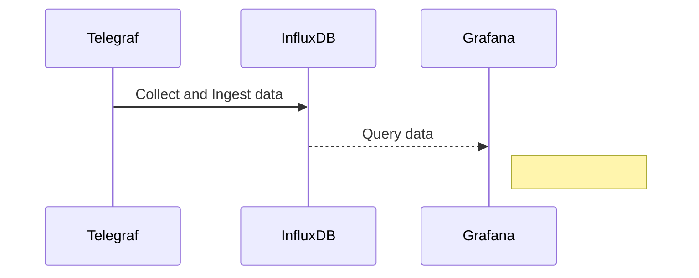

# Monitoring with Telegraf InfluxDB and Grafana!

# Start Influx and Grafana
This step will start two containers  the first container is the time series database InfluxDB, the second container is the grafana tha will be used to create graphs and dashboards. 
> cd influx-grafana

> docker  run  -d  --name=grafana  --network  monitoring  -p  3000:3000  grafana/grafana

> docker  run  --name  influxdb  -d  -p  8086:8086  --network  monitoring  --volume  ./influxdb2:/var/lib/influxdb2  --volume  ./config.yml:/etc/influxdb2/config.yml  influxdb:2.7.1

## Configure InfluxDB
Open influxDB interface in your browser, set organization and bucket.

> http://localhost:8086/

[follow the guide](InfluxDB-Config.pdf)

## Connect Grafana to InfluxDB

[follow the guide](Grafana-influxDB-config.pdf)

## Agent and Metrics

In this step we will use a docker container with a telegraf agent installed to simulate another computer. This agent will collect and ingest the data in InfluxDB.
Update telegraf.conf with the token generated in step before. and run

> cd .. && cd telegraf-agent

> docker run --network monitoring -v $PWD/telegraf.conf:/etc/telegraf/telegraf.conf:ro telegraf

## Querying Data

[follow the guide](QueryingData.pdf)